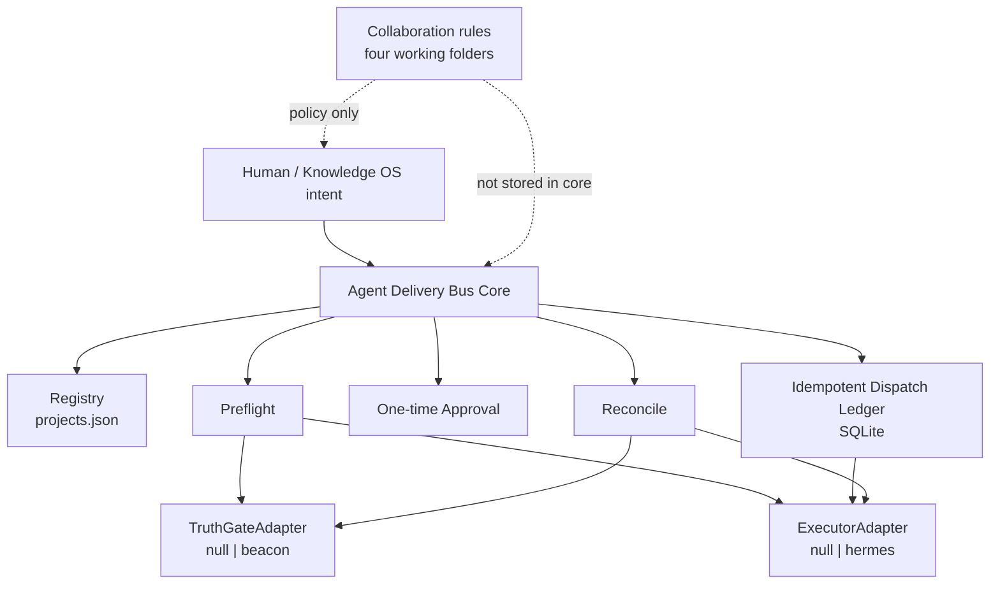
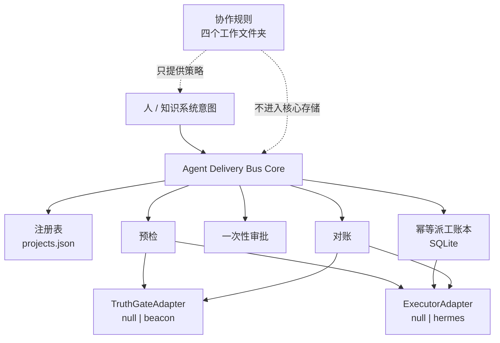

# Agent Delivery Bus

[](https://github.com/justin-mc-lai/agent-delivery-bus/releases)
[](LICENSE)
[](https://www.python.org/downloads/)
[](#development--开发)

[English](#english) | [中文](#中文)

Governed local control plane for multi-project agent delivery.

Not a wiki. Not a generic job queue. Not an autopilot release bot.

It answers one hard question safely:

> Which project, which stage, with whose approval, through which executor, and what evidence counts as done?

---

## English

### Architecture



Authority split:

| Authority | Owner |
|-----------|-------|
| Project routing | Registry (`config/projects.json`) |
| Execution lifecycle | Executor adapter (`null` demo / `hermes` example) |
| Delivery verdict | Truth-gate adapter (`null` demo / `beacon` example) |
| Approval + idempotency + audit | ADB SQLite ledger |
| Inspiration / methods / notes | External Knowledge OS |

### Open-source shape

- **Core**: registry, preflight, one-time approvals, SQLite ledger, dispatch FSM, reconcile
- **Adapter SPI**: `TruthGateAdapter` + `ExecutorAdapter`
- **Demo adapters**: `null` (no external deps)
- **Example adapters**: Beacon, Hermes
- **Neutral by design**: ADB schedules through a strong-rule dispatch envelope
  (binding profile + evidence spec) and never requires a specific truth gate;
  Beacon is the built-in reference implementation/profile, not a dependency
- **Skills**: control-plane skill + collaboration-rules template
- **Runtime deps**: none (Python stdlib + SQLite)

### Quick start (no Hermes required)

```bash
python3 -m pip install -e '.[test]'
cp config/projects.example.json config/projects.json
# default adapters are null/null

bin/adb projects list --json
bin/adb doctor --project demo-app --json
bin/adb dispatch --project demo-app --stage plan --feature example --dry-run --json
bin/adb dispatch --project demo-app --stage plan --feature example --json
bin/adb reconcile --json
bin/adb fleet
bin/adb fleet --json
bin/adb boards status --project demo-app
```

Restricted stage still needs approval:

```bash
bin/adb approve --actor you --project demo-app --stage implement --feature example --json
bin/adb dispatch --project demo-app --stage implement --feature example --approval-token <token> --json
```

### Real delivery adapters

```json
{
  "adapters": {
    "executor": "hermes",
    "truth_gate": "beacon"
  }
}
```

Implement your own backends against:

- `agent_delivery_bus.adapters.spi.ExecutorAdapter`
- `agent_delivery_bus.adapters.spi.TruthGateAdapter`
- `agent_delivery_bus.adapters.channel.ChannelAdapter` (optional; outbound
  delivery is decoupled from execution so pi-style workers without a chat
  channel can still report results)

### Session-aware dispatch

Channel threads bind to a target executor session with `adb session bind`:

```bash
adb session bind --channel feishu --thread oc_1:om_2 --actor open_1 \
  --host-session h1 --target pi --target-session fixed:pi-thread-1
```

Resolution order: explicit `--target-executor` → session binding → project
`executor_policy` → channel default (hermes coding). The resolved target
actually drives the executor adapter (`pi` → PiExecutorAdapter; `codex` /
`claude` / `coding` → Hermes assignee profiles); a mismatch fails closed with
`executor_mismatch`. Session identity excludes `host_session` (audit only),
business idempotency keys exclude routing fields, fixed sessions are
lease-mutexed, and pi runs asynchronously with durable `running` →
`done`/`failed` receipts.

### Workflow presets (third-party enforced workflows)

ADB is workflow-agnostic. Two popular open-source workflows ship as presets:

- `superpowers` — open-source Claude Code skill framework (skill workflows)
- `openspec` — open-source spec-driven development workflow

```bash
adb workflow list --json
adb workflow install --name my-spec --preset openspec --json
adb workflow show my-spec --json
adb workflow remove my-spec --yes --json
```

Generic adaptation of any open-source repo (host-agent mode — adb never calls
an external LLM; the host agent fills the analysis response):

```bash
adb workflow ingest --source https://github.com/org/repo --name my-wf
# host agent reads the repo, fills workflow-analysis-response.v1
adb workflow draft apply --name my-wf --request-json ... --response-json ...
adb workflow draft show --name my-wf
adb workflow confirm --name my-wf --yes
adb workflow verify --name my-wf --project <slug>
adb workflow trace --name my-wf
adb workflow debug --name my-wf
```

Channels resolve one canonical keyword map: `adb intent keywords --json`
(Feishu / WeChat / Line agnostic). The beacon lifecycle
(plan/truth/implement/qa/freeze/goal) is ADB's first-party capability and is
NOT a preset; dispatched tasks force-load the bound skill into the worker
(`hermes --skill`), and preflight fails closed when the device lacks it.

Per-project routing overrides the global pair (falls back when unset):

```json
{
  "adapters": {"executor": "hermes", "truth_gate": "beacon"},
  "projects": [
    {
      "slug": "other-agent-project",
      "repo": "/path/to/project",
      "executor": "hermes",
      "truth_gate": "custom",
      "binding_profile": "generic",
      "metadata": {
        "binding_profile": {
          "stages": {
            "implement": {"skill": "my-impl", "command": "run-impl {feature}", "public_harness": "implement"}
          },
          "evidence_spec": {"evidence_dir": ".adb/evidence", "glob": "*.json", "dispatch_id_binding": true}
        }
      }
    }
  ]
}
```

### Natural-language dispatch (end-to-end)

Talk to any channel hosting the ADB skill (Feishu / WeChat / Line / Codex / Claude).
One canonical keyword map serves every channel: `adb intent keywords --json`.

```text
You:    "adb 派发 1 的 order-page 实现"          (or: adb dispatch 1 order-page implement)
Agent:  adb intent parse → shows dispatch envelope (#project / stage / feature / approval risk)
        → waits for confirmation (never dispatches without it)
You:    "确认"
Agent:  restricted stages (implement/freeze): adb approve --actor you ...
        → adb dispatch --dry-run → adb dispatch
        (hermes task force-loads the bound skill; missing skill → binding_skill_missing)
Worker: executes the skill workflow, writes evidence + manifest (dispatch_id)
You:    "验收" / adb reconcile → completed only when evidence closure passes
Release: always a human gate, never automatic
```

Query intents (待审 / 状态 / fleet) run read-only without confirmation. A configured
workflow must pass `adb workflow verify` before any real dispatch
(`workflow_verify_required` otherwise).

### Registering a new project

```bash
adb projects register --slug my-app --class managed --repo /path/to/my-app \
  --aliases app,myapp --truth-gate null --executor hermes --binding-profile openspec
adb projects list --numbered          # index auto-assigned (max+1, never reused)
adb projects delete 9 --yes           # soft delete by index; restore 9 to bring back
```

Natural language: `登记新项目 my-app，class managed，repo /path/to/my-app` →
envelope → confirm → registered. `binding_profile` decides which workflow the
project uses; the beacon lifecycle (plan/truth/implement/qa/freeze/goal) is the
first-party default, presets/ingested workflows are opt-in per project.
When `--binding-profile` is omitted, the new project uses the first-party
beacon lifecycle by default; `adb projects register` prints the effective
binding (`effective_binding_profile`) so the default is never silent. A
configured workflow must pass `adb workflow verify` before real dispatch.

### Binding an open-source workflow skill

```bash
# 1) Use a preset (peer skill workflows, not CLI tools)
adb workflow install --name my-spec --preset openspec --json

# 2) Adapt any open-source repo (host-agent mode: adb inventories, the host
#    agent — the LLM running adb — fills the analysis response)
adb workflow ingest --source https://github.com/org/repo --name my-wf
adb workflow draft apply --name my-wf --request-json <req> --response-json <resp>
adb workflow confirm --name my-wf --yes
adb workflow verify --name my-wf --project <slug>

# 3) Bind to a project (real dispatch is blocked until verify passes)
adb projects register --slug app2 --class managed --repo /path/app2 --binding-profile my-wf
```

Natural language: `接入工作流 https://github.com/org/repo，名字 my-wf` → ingest →
host agent fills the response → confirm → verify → bind. JSONL traces are kept
for debugging: `adb workflow trace --name my-wf` / `adb workflow debug --name my-wf`.

### What it does / does not do

**Does**

- exact project resolve by slug / alias / path
- read-only strict preflight
- one-time scoped approval for `implement` / `freeze`
- idempotent dispatch
- evidence reconciliation
- stable `reason_code` + `resume_action`

**Does not**

- auto-release / auto-merge / auto-deploy
- auto-repair project context
- read executor private databases
- replace your knowledge base
- become a cluster scheduler
- treat inbox notes as software truth

### Knowledge OS boundary

Keep these four folders **outside** ADB:

1. Projects
2. Knowledge assets
3. Inspiration inbox
4. Collaboration rules

ADB only governs the handoff from approved project work to executor + evidence.

See `skills/collaboration-rules-template/`.

### Development

```bash
python3 -m pip install -e '.[test]'
python3 -m pytest -q
```

### License

MIT

---

## 中文

### 架构



权威拆分：

| 权威 | 归属 |
|------|------|
| 项目路由 | 注册表 |
| 执行生命周期 | Executor（`null` 演示 / `hermes` 示例） |
| 交付判定 | Truth-gate（`null` 演示 / `beacon` 示例） |
| 审批 + 幂等 + 审计 | ADB SQLite |
| 灵感 / 方法 / 笔记 | 外部知识系统 |

### 开源形态

- **Core**：注册表、预检、一次性审批、SQLite 账本、派工状态机、对账
- **Adapter SPI**：`TruthGateAdapter` + `ExecutorAdapter`
- **演示适配器**：`null`（零外部依赖）
- **示例适配器**：Beacon、Hermes
- **天然中立**：ADB 通过强规则派发信封（binding profile + evidence spec）调度，
  不要求特定 truth gate；Beacon 是内置参考实现（参考 profile），不是依赖
- **Skill**：控制面 skill + 协作规则模板
- **运行时依赖**：无

### 快速开始（不需要 Hermes）

```bash
python3 -m pip install -e '.[test]'
cp config/projects.example.json config/projects.json

bin/adb projects list --json
bin/adb doctor --project demo-app --json
bin/adb dispatch --project demo-app --stage plan --feature example --dry-run --json
bin/adb dispatch --project demo-app --stage plan --feature example --json
bin/adb reconcile --json
bin/adb fleet
bin/adb fleet --json
```

### 真实交付适配器

```json
{
  "adapters": {
    "executor": "hermes",
    "truth_gate": "beacon"
  }
}
```

### 工作流预设（第三方强制工作流）

ADB 与工作流解耦，内置 2 个热门开源预设：

- `superpowers` — 开源 Claude Code skill 框架（skill 工作流）
- `openspec` — 开源 spec 驱动开发工作流

```bash
adb workflow list --json
adb workflow install --name my-spec --preset openspec --json
adb workflow show my-spec --json
adb workflow remove my-spec --yes --json
```

任意开源库通用适配（host-agent 模式，adb 不调外部 LLM）：`ingest` 盘点 →
宿主 agent 回填 → `draft apply` → 确认 → `verify` → 绑定派发；全程
`trace/debug` 可查。渠道统一查 `adb intent keywords --json` 规范关键词表。
beacon 生命周期（plan/truth/implement/qa/freeze/goal）是 ADB 第一方能力，
不是预设；派发任务 force-load 绑定 skill，缺 skill 时 preflight fail-closed。

### 自然语言调度派发（完整流程）

在任意承载 ADB skill 的渠道说话（飞书 / 微信 / Line / Codex / Claude），
所有渠道共用同一张关键词表：`adb intent keywords --json`。

```text
你：    "adb 派发 1 的 order-page 实现"
agent： adb intent parse → 回显派工单草稿（#项目 / 阶段 / 活儿 / 审批风险）
        → 等你确认（未确认绝不派发）
你：    "确认"
agent： 受限阶段（实现/冻结）先 adb approve --actor you ...
        → adb dispatch --dry-run → adb dispatch
        （hermes 任务强制加载绑定 skill；缺 skill → binding_skill_missing）
worker：按 skill 工作流执行，写证据 + manifest（dispatch_id）
你：    "验收" / adb reconcile → 证据 closure 通过才算 completed
发布：  永远是人工门，绝不自动
```

查询类意图（待审 / 状态 / fleet）只读执行，不需要确认。配置过的工作流必须
先 `adb workflow verify` 通过才能真实派发（否则 `workflow_verify_required`）。

### 绑定新增项目

```bash
adb projects register --slug my-app --class managed --repo /path/to/my-app \
  --aliases app,myapp --truth-gate null --executor hermes --binding-profile openspec
adb projects list --numbered          # 编号自动分配（max+1，不重用）
adb projects delete 9 --yes           # 按编号软删除；restore 9 可恢复
```

自然语言：`登记新项目 my-app，class managed，repo /path/to/my-app` →
草稿 → 确认 → 登记完成。`binding_profile` 决定项目用哪个工作流：
beacon 生命周期（plan/truth/implement/qa/freeze/goal）是第一方默认，
预设/接入的工作流按项目可选绑定。
未指定 `--binding-profile` 时，新项目默认使用第一方 beacon 生命周期；
`adb projects register` 会明确输出 `effective_binding_profile`，默认不静默。
配置过的工作流必须先 `adb workflow verify` 通过才能真实派发。

### 绑定开源工作流 skill

```bash
# 1) 用预设（对标的 skill 工作流，不是 CLI 工具）
adb workflow install --name my-spec --preset openspec --json

# 2) 适配任意开源库（host-agent 模式：adb 只盘点，宿主 agent——承载 adb 的
#    LLM——负责回填分析响应）
adb workflow ingest --source https://github.com/org/repo --name my-wf
adb workflow draft apply --name my-wf --request-json <req> --response-json <resp>
adb workflow confirm --name my-wf --yes
adb workflow verify --name my-wf --project <slug>

# 3) 绑定到项目（verify 通过前不允许真实派发）
adb projects register --slug app2 --class managed --repo /path/app2 --binding-profile my-wf
```

自然语言：`接入工作流 https://github.com/org/repo，名字 my-wf` → ingest →
宿主 agent 回填 → 确认 → verify → 绑定。全程 JSONL trace 可排查：
`adb workflow trace --name my-wf` / `adb workflow debug --name my-wf`。

### 知识库边界

四个可执行文件夹放在 ADB **之外**：

1. 项目
2. 知识资产
3. 灵感收集
4. 协作规则

ADB 只负责把“已批准的项目工作”安全交接给“执行器 + 证据闭环”。

### 开发

```bash
python3 -m pip install -e '.[test]'
python3 -m pytest -q
```

### License

MIT
