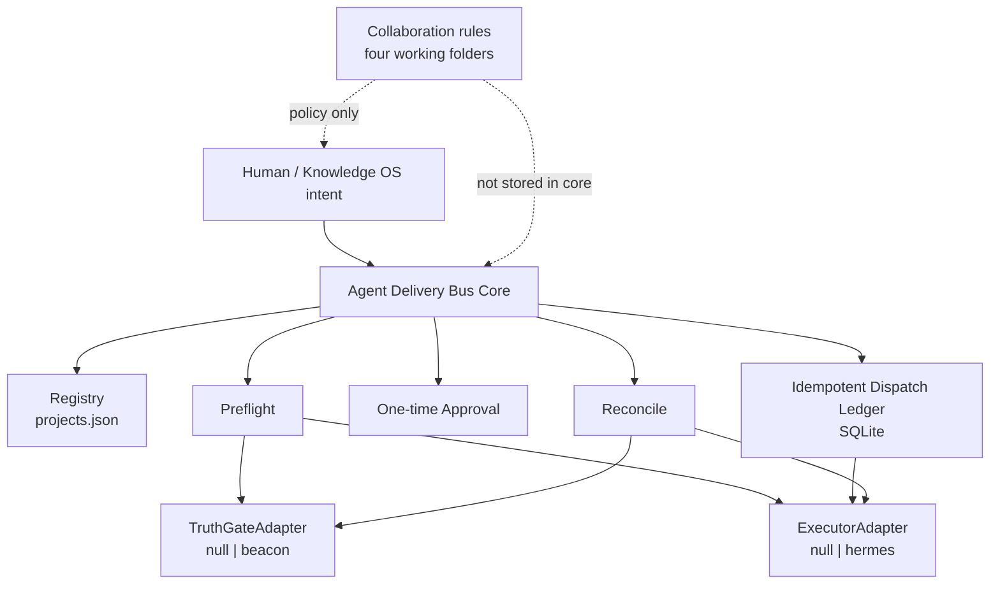
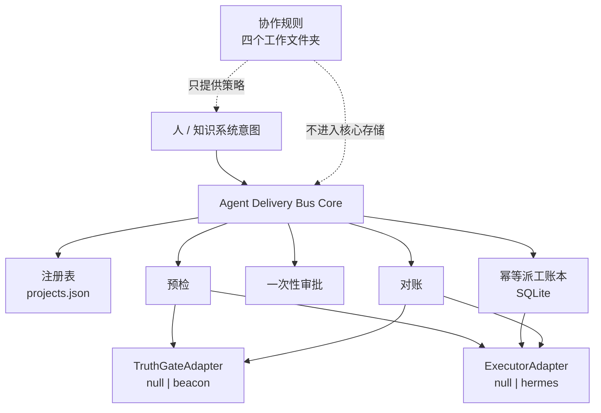

# Agent Delivery Bus

[](https://github.com/justin-mc-lai/agent-delivery-bus/releases)
[](LICENSE)
[](https://www.python.org/downloads/)
[](#development--开发)

[English](#english) | [中文](#中文)

Governed local control plane for multi-project agent delivery.

Not a wiki. Not a generic job queue. Not an autopilot release bot.

It answers one hard question safely:

> Which project, which stage, with whose approval, through which executor, and what evidence counts as done?

---

## English

### Architecture



Authority split:

| Authority | Owner |
|-----------|-------|
| Project routing | Registry (`config/projects.json`) |
| Execution lifecycle | Executor adapter (`null` demo / `hermes` example) |
| Delivery verdict | Truth-gate adapter (`null` demo / `beacon` example) |
| Approval + idempotency + audit | ADB SQLite ledger |
| Inspiration / methods / notes | External Knowledge OS |

### Open-source shape

- **Core**: registry, preflight, one-time approvals, SQLite ledger, dispatch FSM, reconcile
- **Adapter SPI**: `TruthGateAdapter` + `ExecutorAdapter`
- **Demo adapters**: `null` (no external deps)
- **Example adapters**: Beacon, Hermes
- **Neutral by design**: ADB schedules through a strong-rule dispatch envelope
  (binding profile + evidence spec) and never requires a specific truth gate;
  Beacon is the built-in reference implementation/profile, not a dependency
- **Skills**: control-plane skill + collaboration-rules template
- **Runtime deps**: none (Python stdlib + SQLite)

### Quick start (no Hermes required)

```bash
python3 -m pip install -e '.[test]'
cp config/projects.example.json config/projects.json
# default adapters are null/null

bin/adb projects list --json
bin/adb doctor --project demo-app --json
bin/adb dispatch --project demo-app --stage plan --feature example --dry-run --json
bin/adb dispatch --project demo-app --stage plan --feature example --json
bin/adb reconcile --json
bin/adb fleet
bin/adb fleet --json
bin/adb boards status --project demo-app
```

Restricted stage still needs approval:

```bash
bin/adb approve --actor you --project demo-app --stage implement --feature example --json
bin/adb dispatch --project demo-app --stage implement --feature example --approval-token <token> --json
```

### Real delivery adapters

```json
{
  "adapters": {
    "executor": "hermes",
    "truth_gate": "beacon"
  }
}
```

Implement your own backends against:

- `agent_delivery_bus.adapters.spi.ExecutorAdapter`
- `agent_delivery_bus.adapters.spi.TruthGateAdapter`

Per-project routing overrides the global pair (falls back when unset):

```json
{
  "adapters": {"executor": "hermes", "truth_gate": "beacon"},
  "projects": [
    {
      "slug": "other-agent-project",
      "repo": "/path/to/project",
      "executor": "hermes",
      "truth_gate": "custom",
      "binding_profile": "generic",
      "metadata": {
        "binding_profile": {
          "stages": {
            "implement": {"skill": "my-impl", "command": "run-impl {feature}", "public_harness": "implement"}
          },
          "evidence_spec": {"evidence_dir": ".adb/evidence", "glob": "*.json", "dispatch_id_binding": true}
        }
      }
    }
  ]
}
```

### What it does / does not do

**Does**

- exact project resolve by slug / alias / path
- read-only strict preflight
- one-time scoped approval for `implement` / `freeze`
- idempotent dispatch
- evidence reconciliation
- stable `reason_code` + `resume_action`

**Does not**

- auto-release / auto-merge / auto-deploy
- auto-repair project context
- read executor private databases
- replace your knowledge base
- become a cluster scheduler
- treat inbox notes as software truth

### Knowledge OS boundary

Keep these four folders **outside** ADB:

1. Projects
2. Knowledge assets
3. Inspiration inbox
4. Collaboration rules

ADB only governs the handoff from approved project work to executor + evidence.

See `skills/collaboration-rules-template/`.

### Development

```bash
python3 -m pip install -e '.[test]'
python3 -m pytest -q
```

### License

MIT

---

## 中文

### 架构



权威拆分：

| 权威 | 归属 |
|------|------|
| 项目路由 | 注册表 |
| 执行生命周期 | Executor（`null` 演示 / `hermes` 示例） |
| 交付判定 | Truth-gate（`null` 演示 / `beacon` 示例） |
| 审批 + 幂等 + 审计 | ADB SQLite |
| 灵感 / 方法 / 笔记 | 外部知识系统 |

### 开源形态

- **Core**：注册表、预检、一次性审批、SQLite 账本、派工状态机、对账
- **Adapter SPI**：`TruthGateAdapter` + `ExecutorAdapter`
- **演示适配器**：`null`（零外部依赖）
- **示例适配器**：Beacon、Hermes
- **天然中立**：ADB 通过强规则派发信封（binding profile + evidence spec）调度，
  不要求特定 truth gate；Beacon 是内置参考实现（参考 profile），不是依赖
- **Skill**：控制面 skill + 协作规则模板
- **运行时依赖**：无

### 快速开始（不需要 Hermes）

```bash
python3 -m pip install -e '.[test]'
cp config/projects.example.json config/projects.json

bin/adb projects list --json
bin/adb doctor --project demo-app --json
bin/adb dispatch --project demo-app --stage plan --feature example --dry-run --json
bin/adb dispatch --project demo-app --stage plan --feature example --json
bin/adb reconcile --json
bin/adb fleet
bin/adb fleet --json
```

### 真实交付适配器

```json
{
  "adapters": {
    "executor": "hermes",
    "truth_gate": "beacon"
  }
}
```

### 知识库边界

四个可执行文件夹放在 ADB **之外**：

1. 项目
2. 知识资产
3. 灵感收集
4. 协作规则

ADB 只负责把“已批准的项目工作”安全交接给“执行器 + 证据闭环”。

### 开发

```bash
python3 -m pip install -e '.[test]'
python3 -m pytest -q
```

### License

MIT
